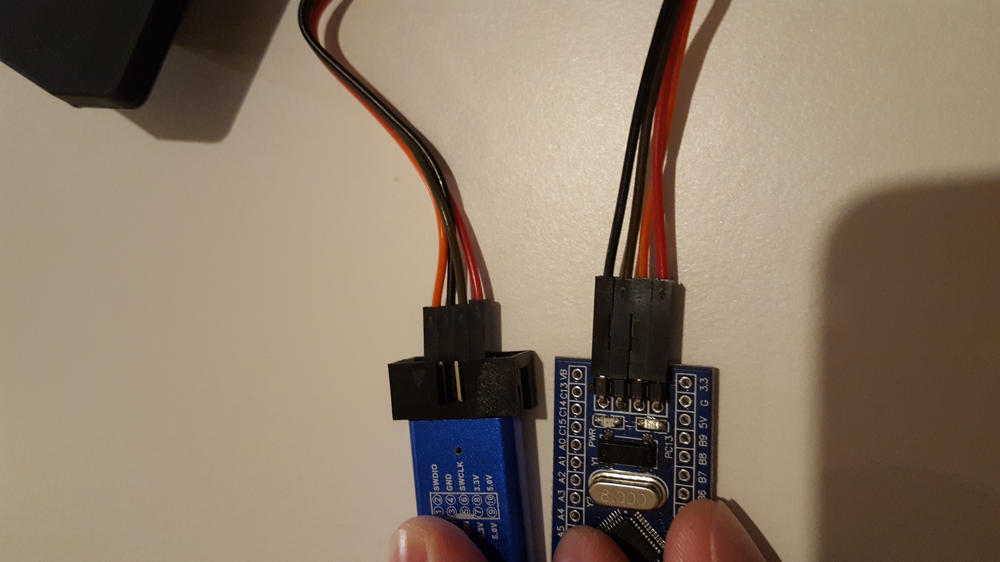

# Setup

I used this [readme](http://example.com "readme") to help me start.
I bought my blue pills [here](https://www.amazon.fr/gp/product/B07B2D4QKY/ref=ppx_yo_dt_b_asin_title_o03_s00?ie=UTF8&psc=1)

This is the wiring I use for my ST-link V2:



## Obstacles

```
UNEXPECTED idcode: 0x2ba01477
```

I copied the `/usr/share/openocd/scripts/target/stm32f1x.cfg` file, naming the copy `cs32f1x.cfg` and changed:

- the name of the chip:

```
if { [info exists CHIPNAME] } {
   set _CHIPNAME $CHIPNAME
} else {
   set _CHIPNAME cs32f1x
}
```

- the idcode:

```
#jtag scan chain
if { [info exists CPUTAPID] } {
   set _CPUTAPID $CPUTAPID
} else {
   if { [using_jtag] } {
      # See STM Document RM0008 Section 26.6.3
      set _CPUTAPID 0x3ba00477
   } {
      # this is the SW-DP tap id not the jtag tap id
      set _CPUTAPID 0x2ba01477
   }
}
```

openocd should be run from the directory, as its config is there.
